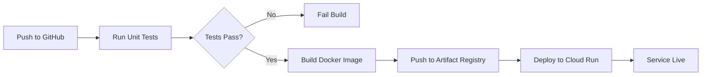

# Improvements Summary

This document summarizes the deployment and testing infrastructure added to the Gemini Homicide Bot.

## 🚀 Deployment Infrastructure

### Files Added

1. **`Dockerfile`**
   - Production-ready Python 3.11-slim base image
   - Installs dependencies and Gunicorn
   - Configured for Cloud Run (port 8080, GOOGLE_API_KEY injection)
   - Health check endpoint for container orchestration
   - 1 worker, 8 threads, optimized for Cloud Run

2. **`.dockerignore`**
   - Excludes unnecessary files from Docker build context
   - Reduces image size and speeds up builds

3. **`.github/workflows/deploy-cloud-run.yml`**
   - Automated CI/CD pipeline
   - Runs unit tests on every push
   - Builds and pushes Docker image to Artifact Registry
   - Deploys to Cloud Run on main branch pushes
   - Uses Workload Identity Federation (no long-lived secrets)

4. **`DEPLOYMENT.md`**
   - Complete step-by-step deployment guide
   - Prerequisites and setup instructions
   - Manual and automated deployment options
   - Cost estimates, monitoring, security best practices
   - Troubleshooting and rollback procedures

### Deployment Options

**1. Manual Deployment (5 minutes)**
```bash
gcloud run deploy gemini-homicide-bot \
  --source . \
  --region us-central1 \
  --set-secrets=GOOGLE_API_KEY=gemini-api-key:latest
```

**2. Automated with GitHub Actions**
- Push to main → automatic deployment
- Runs tests first, fails deployment if tests fail
- Shows service URL in Actions output

**3. Local Docker Testing**
```bash
docker build -t gemini-homicide-bot .
docker run -p 8080:8080 -e GOOGLE_API_KEY="key" gemini-homicide-bot
```

## 🧪 Testing Infrastructure

### Files Added

1. **`tests/fixtures/mini_homicides.csv`**
   - 20-row deterministic test dataset
   - Covers multiple years (2020-2024)
   - Varied districts, wards, community areas
   - Mix of arrest/non-arrest, domestic/non-domestic cases
   - Known data distribution for precise assertions

2. **`tests/test_homicide_mcp.py`**
   - 30+ unit tests for HomicideDataMCP
   - Tests data loading, normalization, filtering
   - Validates query_homicides_advanced logic
   - Tests group_by, top_n, multi-criteria filtering
   - Edge cases and error handling
   - **Run with:** `pytest tests/test_homicide_mcp.py -v`

3. **`tests/__init__.py`**
   - Makes tests directory a proper Python package

### Expanded `test_llm_performance.py`

**New Test Categories:**

1. **Complex Multi-Criteria** (expanded)
   - Multi-filter + grouping queries
   - Example: "Top 3 districts with non-domestic homicides where no arrests were made, 2015-2019"
   - Tests 6 simultaneous parameters

2. **Negative Cases** (new)
   - Ensures model doesn't call tools for non-homicide questions
   - Tests: weather, Chicago history, general questions
   - Validates tool-calling restraint

3. **Year Range Variations** (new)
   - Different phrasings: "from X to Y", "between X and Y", "through"
   - Tests start_year and end_year extraction accuracy

4. **Synonym Variations** (new)
   - Tests "murders", "killings", "homicides"
   - Tests "highest number", "most", "least"
   - Validates semantic understanding

**New Validation Logic:**

1. **Answer Consistency Checker**
   - Validates LLM answer matches tool output
   - For group_by queries: checks if top result is mentioned
   - For count queries: verifies numeric accuracy (within 10%)
   - Catches hallucinations and misinterpretations

2. **Year Range Validation**
   - Checks start_year and end_year parameter accuracy
   - Validates boundary conditions

3. **Enhanced Reporting**
   - Per-category pass rates
   - Answer consistency score
   - Detailed failure reasons
   - Tool latency tracking

### Test Suite Metrics

**Coverage:**
- Simple queries: 2 cases
- "Which X most" queries: 2 cases
- Top N queries: 1 case
- Complex multi-criteria: 4 cases
- Negative cases: 3 cases
- Year range variations: 2 cases
- Synonym variations: 2 cases
- **Total: 16 LLM test cases** (up from 7)

**Validation Points:**
- Tool selection accuracy
- Parameter extraction (10+ parameter types)
- Answer consistency with data
- Response time
- Error handling
- Negative case handling

## 📊 README Updates

### New Sections

1. **Deploying to Google Cloud Run**
   - Prerequisites and setup
   - Manual and automated deployment
   - Local Docker testing
   - Alternative deployment options

2. **Testing**
   - Unit test instructions
   - LLM performance test suite overview
   - Test category descriptions
   - Result interpretation

### Updated Sections

- Removed old generic deployment section
- Added concrete Cloud Run instructions
- Added testing best practices
- Added CI/CD workflow description

## 🎯 Benefits

### Deployment

1. **Reproducible**: Dockerfile ensures consistent environment
2. **Automated**: Push to main → automatic deployment
3. **Secure**: API key in Secret Manager, Workload Identity Federation
4. **Scalable**: Auto-scales 0-10 instances, pay-per-use
5. **Fast**: < 5 minutes from code change to live deployment
6. **Zero-downtime**: Cloud Run handles traffic shifting
7. **Cost-effective**: Likely free under moderate usage

### Testing

1. **Fast feedback**: Unit tests run in CI on every push
2. **Deterministic**: Fixture-based tests eliminate flakiness
3. **Comprehensive**: 16 diverse LLM test cases
4. **Measurable**: Quantitative pass rates per category
5. **Debuggable**: Detailed failure reasons and traces
6. **Comparable**: Test multiple models side-by-side
7. **Answer validation**: Catches hallucinations and errors

## 🔄 CI/CD Workflow



**On every push:**
- Unit tests run (pytest)
- Build status reported

**On main branch push:**
- All above +
- Docker image build
- Deployment to Cloud Run
- Service URL in workflow output

## 📈 Next Steps for Further Improvement

### Suggested Enhancements

1. **Monitoring**
   - Add Cloud Monitoring alerts for errors
   - Set up uptime checks
   - Track token usage and costs

2. **Testing**
   - Add integration tests for full end-to-end flows
   - Mock Gemini API for faster CI tests
   - Add load testing for Cloud Run autoscaling

3. **Performance**
   - Cache common queries in Redis/Memorystore
   - Add query result pagination
   - Optimize Docker image size (<200MB)

4. **Features**
   - Add authentication for private deployment
   - Store conversation history
   - Add data export endpoints

5. **Multi-provider MCPs** (exploratory)
   - Education MCP (CPS data by community area)
   - Census MCP (ACS demographics)
   - Multi-city homicide MCP (NYC, LA)
   - Cross-dataset correlation queries

## 🛠️ Usage Examples

### Deploy to Cloud Run
```bash
# One-time setup
gcloud secrets create gemini-api-key --data-file=- <<< "YOUR_KEY"

# Deploy
gcloud run deploy gemini-homicide-bot --source . --region us-central1
```

### Run Unit Tests
```bash
pytest tests/test_homicide_mcp.py -v
```

### Run LLM Performance Tests
```bash
python test_llm_performance.py
# Results saved to: llm_test_results_<timestamp>.json
```

### Test Locally with Docker
```bash
docker build -t gemini-homicide-bot .
docker run -p 8080:8080 -e GOOGLE_API_KEY="your-key" gemini-homicide-bot
curl http://localhost:8080/api/health
```

## 📝 Files Modified

- `README.md`: Added deployment and testing sections
- `test_llm_performance.py`: Added 9 new test cases + answer validation

## 📁 Files Created

- `Dockerfile`
- `.dockerignore`
- `.github/workflows/deploy-cloud-run.yml`
- `tests/__init__.py`
- `tests/fixtures/mini_homicides.csv`
- `tests/test_homicide_mcp.py`
- `DEPLOYMENT.md`
- `IMPROVEMENTS.md` (this file)

## ✅ Ready to Use

All files are created and ready. To get started:

1. **Deploy to Cloud Run**: See `DEPLOYMENT.md`
2. **Run tests**: `pytest tests/test_homicide_mcp.py -v`
3. **Test LLM performance**: `python test_llm_performance.py`
4. **Test locally**: `docker build -t bot . && docker run -p 8080:8080 -e GOOGLE_API_KEY="key" bot`
